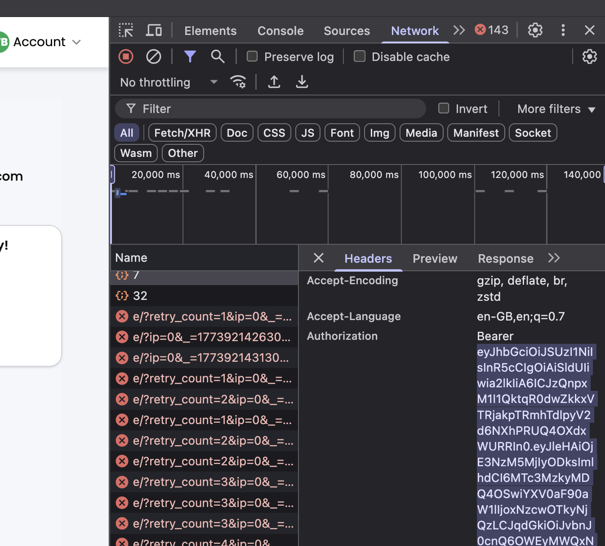

# uptime-readout-poc
A streamlit app that allows the rapid creation of readout materials.

### Getting Started
Create a virtual environment
Install requirements.txt

I've been using `uv`
```
uv init

source .venv/bin/activate

uv sync
```

### Running the app
For analysing muliple chatlogs for competancy scores:

Run: `streamlit run readout.py`

For analysing player's email individual drill performances over time:*

Run: `streamlit run player_report.py`

For comparing multiple players checklist scores across a single drill/level:*

Run: `streamlit run team_checklist.py`

*For these actions you will need a Bearer Auth Token to access the Analytics API

1. Open `learn.uptimelabs.io` > right-click and open the dev tools and go to the 'Network' tab. > Select 'Headers'

2. Navigate to a report page and select one of the network requests with a `{:}` icon.

3. Scroll down and you should see the Bearer Token. Copy and paste this into the sidebar (Do NOT include 'Bearer').



---

AWS Models

Obtain releavnt AWS credentials by running:

`tsh proxy aws --app awsconsole-prod`

This will return:
```
AWS_ACCESS_KEY
AWS_SECRET_ACCESS_KEY
```

Retrieve a list of Amazon Bedrock Models:
`tsh aws bedrock list-foundation-models --region eu-west-1`

`tsh aws bedrock list-inference-profiles --region eu-west-1`